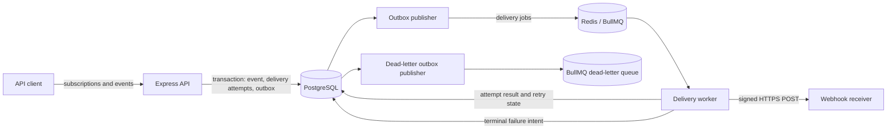

# Pigeon

Pigeon is a reliable webhook delivery service built with Node.js and TypeScript. Clients register HTTPS endpoints for the event types they care about, submit events through an authenticated API, and inspect delivery outcomes while Pigeon handles fan-out, signing, retries, throttling, and dead-lettering in the background.

Pigeon provides **at-least-once delivery**. A receiver may see the same logical event more than once and should process webhook requests idempotently.

## Features

- API-key-authenticated subscription and event APIs
- Durable event ingestion and queue publication through a PostgreSQL outbox
- One BullMQ job per matching active subscription
- HMAC-SHA256 signed webhook requests with timestamp and delivery ID headers
- Bounded exponential backoff with jitter and a dead-letter queue
- Per-subscription concurrency control so one endpoint cannot monopolize workers
- SSRF protection for subscription targets and rate limiting for event ingestion
- Structured logs, dependency health checks, Prometheus metrics, and failed-delivery inspection
- Unit, integration, and mocked outbound-worker tests

## Architecture



The API, publishers, and worker run in the same Node.js process. PostgreSQL stores clients, subscriptions, immutable events, every delivery attempt, and durable queue-publication intent. Redis backs the delivery and dead-letter queues.

When a client submits an event, Pigeon atomically stores the event, creates a pending delivery for every matching active subscription, and records outbox entries. It then returns `202 Accepted` without waiting for receivers. The outbox publisher creates BullMQ jobs, and the worker re-checks subscription status before each signed request. Successful requests are resolved on any `2xx` response; failures are retried and eventually recorded as permanent failures and published to the dead-letter queue.

## Technology

- Node.js 22 and TypeScript
- Express 5
- PostgreSQL and Prisma
- Redis and BullMQ
- Zod, Pino, and Prometheus client
- Vitest, Supertest, and nock

## Prerequisites

- Node.js 22 or newer
- npm
- A running PostgreSQL instance
- A running Redis instance

Container-based local infrastructure will be added in a later phase. For now, run PostgreSQL and Redis using your preferred local installation or containers and make their connection URLs available to Pigeon.

## Local setup

1. Install dependencies:

   ```bash
   npm ci
   ```

2. Copy the example environment file:

   ```bash
   cp .env.example .env
   ```

3. Create the PostgreSQL database referenced by `DATABASE_URL`, then update `.env` if its credentials, host, port, or database name differ from the defaults. Set `REDIS_URL` to your Redis instance as needed.

4. Apply the committed database migrations:

   ```bash
   npm run prisma:deploy
   ```

5. Provision a client credential:

   ```bash
   npm run client:create
   ```

   Save the displayed API key immediately. Pigeon stores only its SHA-256 hash and will not show the raw key again. Authenticated requests send it in the `X-API-Key` header.

## Run locally

Start Pigeon in development mode:

```bash
npm run dev
```

The default listener is `http://localhost:3000`. Confirm that both dependencies are reachable:

```bash
curl -i http://localhost:3000/health
```

A healthy instance responds with HTTP `200` and reports both `database` and `redis` as `up`. Prometheus-format metrics are available at `http://localhost:3000/metrics`.

For a production-style local run, compile and start the generated JavaScript:

```bash
npm run build
npm start
```

Stop the process with `Ctrl+C`; Pigeon handles `SIGINT` and `SIGTERM` by closing the HTTP server, worker, queues, publishers, and database connection.

## Configuration

All configuration is loaded from environment variables and validated at startup. Invalid values fail fast with a configuration error. See [`.env.example`](.env.example) for the complete set of settings and defaults, including worker concurrency, delivery timeout, retry attempts, outbox polling, and ingestion rate limits.

Do not commit `.env`; it may contain database credentials or other deployment-specific values.

## Useful commands

| Command                  | Purpose                                              |
| ------------------------ | ---------------------------------------------------- |
| `npm run dev`            | Run the TypeScript service with automatic restarts   |
| `npm run build`          | Compile application TypeScript into `dist/`          |
| `npm start`              | Run the compiled service                             |
| `npm run client:create`  | Provision a client and one-time API key              |
| `npm run prisma:migrate` | Create or apply migrations during schema development |
| `npm run prisma:deploy`  | Apply committed migrations                           |
| `npm test`               | Run the test suite once                              |
| `npm run test:coverage`  | Run tests and generate coverage                      |
| `npm run typecheck`      | Type-check application and test code                 |
| `npm run lint`           | Run ESLint with zero warnings allowed                |
| `npm run format:check`   | Check formatting with Prettier                       |

## Project structure

```text
prisma/              Prisma schema and SQL migrations
src/config/          Environment validation and logging
src/db/              Prisma client
src/middleware/      Authentication, rate limiting, logging, and errors
src/queue/           BullMQ queue definitions and producers
src/routes/          HTTP route handlers
src/services/        Domain, outbox, security, health, and metrics logic
src/workers/         Webhook delivery worker
tests/               Unit, integration, and worker tests
docs/                Supporting documentation
```

Webhook receiver implementers should also read [Verifying webhook signatures](docs/webhook-signatures.md).
