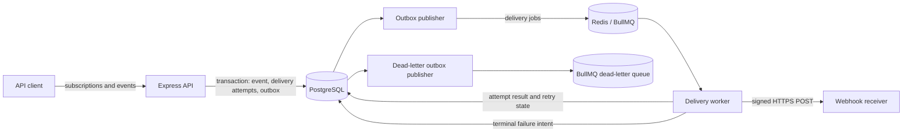

# Pigeon

Pigeon is a reliable webhook delivery service built with Node.js and TypeScript. Clients register HTTPS endpoints for the event types they care about, submit events through an authenticated API, and inspect delivery outcomes while Pigeon handles fan-out, signing, retries, throttling, and dead-lettering in the background.

Pigeon provides **at-least-once delivery**. A receiver may see the same logical event more than once and should process webhook requests idempotently.

## Features

- API-key-authenticated subscription and event APIs
- Durable event ingestion and queue publication through a PostgreSQL outbox
- One BullMQ job per matching active subscription
- HMAC-SHA256 signed webhook requests with timestamp and delivery ID headers
- Bounded exponential backoff with jitter and a dead-letter queue
- Per-subscription concurrency control so one endpoint cannot monopolize workers
- SSRF protection for subscription targets and rate limiting for event ingestion
- Structured logs, dependency health checks, Prometheus metrics, and failed-delivery inspection
- Unit, integration, and mocked outbound-worker tests

## Architecture



The API, publishers, and worker run in the same Node.js process. PostgreSQL stores clients, subscriptions, immutable events, every delivery attempt, and durable queue-publication intent. Redis backs the delivery and dead-letter queues.

When a client submits an event, Pigeon atomically stores the event, creates a pending delivery for every matching active subscription, and records outbox entries. It then returns `202 Accepted` without waiting for receivers. The outbox publisher creates BullMQ jobs, and the worker re-checks subscription status before each signed request. Successful requests are resolved on any `2xx` response; failures are retried and eventually recorded as permanent failures and published to the dead-letter queue.

## Design decisions

### At-least-once delivery

Pigeon promises at-least-once rather than exactly-once delivery because it cannot atomically update its database and an arbitrary receiver's state. A receiver can process a request just before the connection times out, or the worker can stop after receiving a successful response but before recording it. Retrying is the only safe way to avoid silently losing those deliveries, and that retry can create a duplicate.

The event, initial delivery attempts, and queue-publication intent are committed in one PostgreSQL transaction. Outbox entries are retried until BullMQ accepts them, using the delivery-attempt ID as the job ID so republishing is idempotent at the queue boundary. Failed requests use bounded backoff before permanent failure is recorded and published to the dead-letter queue. This prevents unbounded retries but means at-least-once is not a promise that an unavailable receiver will eventually succeed.

Each request includes a signed, unique `X-Delivery-Id`. Receivers should store processed IDs and make business operations idempotent. Because retries receive new attempt IDs, receivers that need event-level de-duplication should also include and store a stable business-event identifier in their payload schema.

### BullMQ instead of Kafka or RabbitMQ

BullMQ directly provides the primitives this service needs: delayed jobs, bounded attempts, custom backoff, worker concurrency, and Redis-backed coordination, with a natural Node.js and TypeScript API. Pigeon's routing model is also simple—one independent job per matching subscription—so a retained event stream or a more elaborate broker topology would not improve the current design.

Kafka would be a stronger fit for a high-throughput, replayable event log with partition ordering and multiple independent consumer groups. RabbitMQ would be a strong fit for richer broker-side routing and acknowledgement patterns. Both add operational and application complexity that this service does not currently need. BullMQ's tradeoff is that Redis is not Pigeon's long-term audit log; PostgreSQL remains the system of record, and the transactional outbox bridges database commits to queue publication.

### What changes at 10× scale

The first step would be to measure queue lag, delivery latency, fan-out size, PostgreSQL write load, and per-target failure rates. A tenfold traffic increase alone would not justify replacing the broker. Likely changes are:

| Area               | Current design                                                 | 10× evolution                                                                                           |
| ------------------ | -------------------------------------------------------------- | ------------------------------------------------------------------------------------------------------- |
| Process topology   | API, publishers, and worker share one process                  | Deploy them separately and scale API and worker capacity independently                                  |
| Event fan-out      | All matching deliveries are created during ingestion           | Persist durable fan-out intent, then create deliveries asynchronously in bounded batches                |
| PostgreSQL         | One indexed transactional store                                | Add connection pooling, retention/archival, and partition high-volume event and delivery tables         |
| Outbox             | One polling publisher per outbox                               | Use multiple claim-based publishers with short transactions and `SKIP LOCKED`-style coordination        |
| Queue              | Shared delivery and dead-letter queues                         | Run highly available Redis and shard queues or worker pools when measured contention requires isolation |
| Receiver isolation | Distributed per-subscription concurrency leases                | Add per-host and per-client quotas, circuit breakers, and explicit backpressure                         |
| Operations         | Health checks, process metrics, and failed-delivery inspection | Alert on queue/outbox lag and SLOs, automate retention, and add controlled dead-letter replay           |

If sustained throughput, long-term replay, strict partition ordering, or many independent consumers became core requirements, Kafka would be reconsidered. If complex routing and broker-managed delivery policies became central, RabbitMQ would be reconsidered. Until then, scaling BullMQ workers and PostgreSQL is the smaller and more predictable path.

## Technology

- Node.js 22 and TypeScript
- Express 5
- PostgreSQL and Prisma
- Redis and BullMQ
- Zod, Pino, and Prometheus client
- Vitest, Supertest, and nock

## Prerequisites

- Docker Engine or Docker Desktop with Docker Compose (recommended)
- Or, for manual development: Node.js 22 or newer, npm, PostgreSQL, and Redis

## Run with Docker

Build the application and start Pigeon, PostgreSQL, and Redis with one command:

```bash
docker compose up --build
```

Compose waits for PostgreSQL to become healthy, applies all committed Prisma migrations, waits for Redis, and then starts the application. PostgreSQL and Redis data are kept in named volumes across restarts.

Confirm that the stack is healthy:

```bash
curl -i http://localhost:3000/health
```

Provision a client and its one-time API key from the running application container:

```bash
docker compose exec app node dist/scripts/create-client.js
```

Stop the stack with `Ctrl+C`, or use `docker compose down` when it is running in the background. To also delete all local PostgreSQL and Redis data, run `docker compose down --volumes`.

By default, the app, PostgreSQL, and Redis bind only to the host loopback interface on ports `3000`, `5432`, and `6379`. Change `PORT`, `POSTGRES_HOST_PORT`, or `REDIS_HOST_PORT` in `.env` if a port is already occupied.

## Manual local setup

### Setup

1. Install dependencies:

   ```bash
   npm ci
   ```

2. Copy the example environment file:

   ```bash
   cp .env.example .env
   ```

3. Create the PostgreSQL database referenced by `DATABASE_URL`, then update `.env` if its credentials, host, port, or database name differ from the defaults. Set `REDIS_URL` to your Redis instance as needed.

4. Apply the committed database migrations:

   ```bash
   npm run prisma:deploy
   ```

5. Provision a client credential:

   ```bash
   npm run client:create
   ```

   Save the displayed API key immediately. Pigeon stores only its SHA-256 hash and will not show the raw key again. Authenticated requests send it in the `X-API-Key` header.

### Run the application

Start Pigeon in development mode:

```bash
npm run dev
```

The default listener is `http://localhost:3000`. Confirm that both dependencies are reachable:

```bash
curl -i http://localhost:3000/health
```

A healthy instance responds with HTTP `200` and reports both `database` and `redis` as `up`. Prometheus-format metrics are available at `http://localhost:3000/metrics`.

For a production-style local run, compile and start the generated JavaScript:

```bash
npm run build
npm start
```

Stop the process with `Ctrl+C`; Pigeon handles `SIGINT` and `SIGTERM` by closing the HTTP server, worker, queues, publishers, and database connection.

## Deployment

Pigeon includes a Render Blueprint that deploys the production Docker image as a public web service with private, persistent PostgreSQL and Redis-compatible Key Value dependencies. Deployments wait for CI, apply Prisma migrations before startup, and use `/health` as the rollout health check.

See the [Render deployment guide](docs/deployment.md) for cost, region, provisioning, verification, and operational guidance. Creating the Blueprint provisions paid resources, so review the selected plans before applying it.

## Configuration

All configuration is loaded from environment variables and validated at startup. Invalid values fail fast with a configuration error. See [`.env.example`](.env.example) for the complete set of settings and defaults, including worker concurrency, delivery timeout, retry attempts, outbox polling, and ingestion rate limits.

Do not commit `.env`; it may contain database credentials or other deployment-specific values.

## Useful commands

| Command                  | Purpose                                              |
| ------------------------ | ---------------------------------------------------- |
| `npm run dev`            | Run the TypeScript service with automatic restarts   |
| `npm run build`          | Compile application TypeScript into `dist/`          |
| `npm start`              | Run the compiled service                             |
| `npm run client:create`  | Provision a client and one-time API key              |
| `npm run prisma:migrate` | Create or apply migrations during schema development |
| `npm run prisma:deploy`  | Apply committed migrations                           |
| `npm test`               | Run the test suite once                              |
| `npm run test:coverage`  | Run tests and generate coverage                      |
| `npm run typecheck`      | Type-check application and test code                 |
| `npm run lint`           | Run ESLint with zero warnings allowed                |
| `npm run format:check`   | Check formatting with Prettier                       |

## Project structure

```text
prisma/              Prisma schema and SQL migrations
src/config/          Environment validation and logging
src/db/              Prisma client
src/middleware/      Authentication, rate limiting, logging, and errors
src/queue/           BullMQ queue definitions and producers
src/routes/          HTTP route handlers
src/services/        Domain, outbox, security, health, and metrics logic
src/workers/         Webhook delivery worker
tests/               Unit, integration, and worker tests
docs/                Supporting documentation
render.yaml          Render Blueprint for the hosted production stack
```

## Documentation

- [OpenAPI API reference](docs/openapi.yaml)
- [Webhook signature verification](docs/webhook-signatures.md)
- [End-to-end demo and recording guide](docs/demo.md)
- [Render deployment guide](docs/deployment.md)
